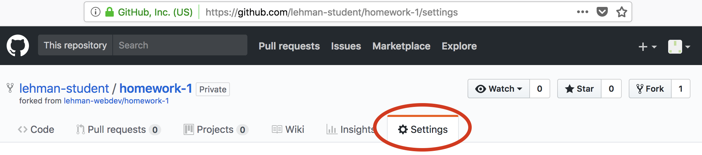
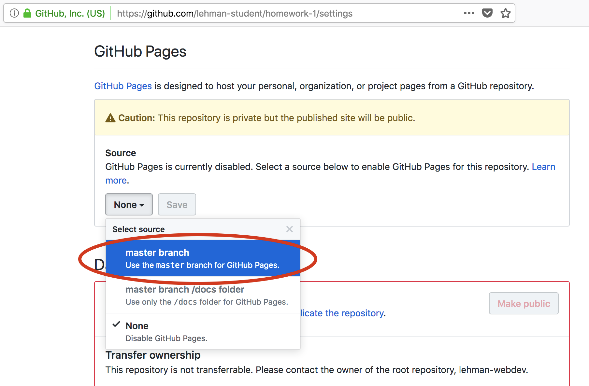
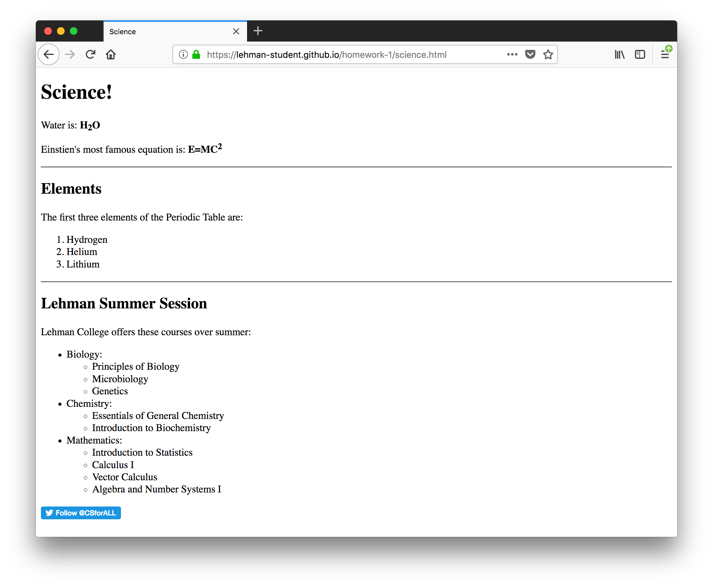
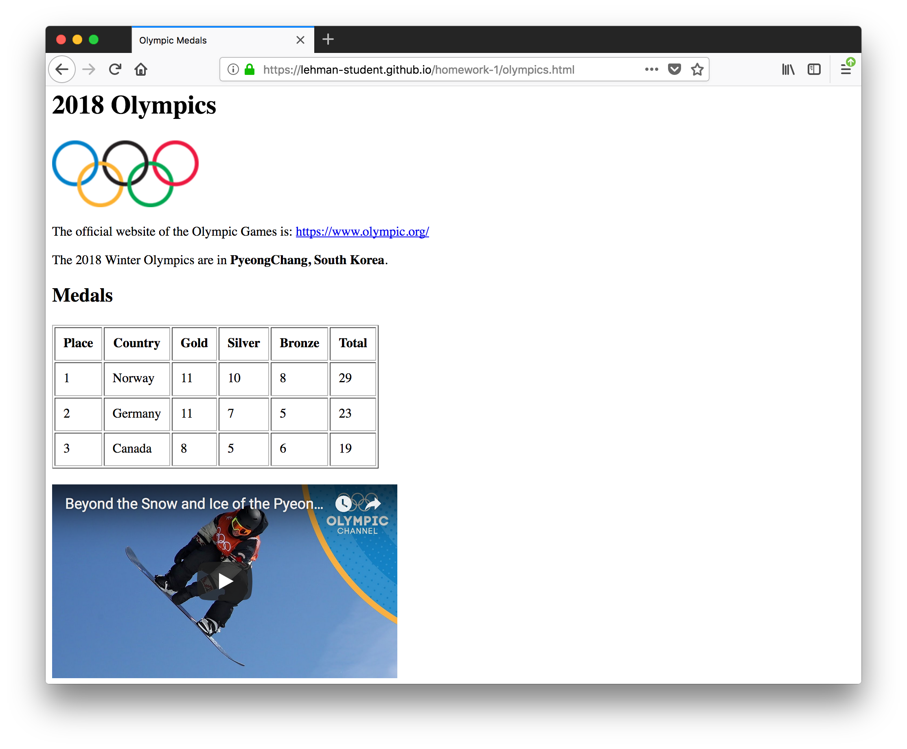

# Homework 1

This homework assignment covers the content that we discussed in class up until and including February 5.

## GitHub

We will exlusively use GitHub for all assignments in this class. Therefore (and because it is broadly used in industry), you should familiarize yourself with GitHub and its features.

### 1. Learn about GitHub

Perform this "Hello World" exercise: https://guides.github.com/activities/hello-world/

### 2. Understand Markdown

[Markdown](https://en.wikipedia.org/wiki/Markdown) is a language for simple text formatting. Usually, markdown files end in `.md` (like this file, `README.md`).

You will complete this homework assignment by modifying this Markdown file (`README.md`).

Take a look at these resources to understand Markdown basics:

* https://help.github.com/articles/basic-writing-and-formatting-syntax/
* https://guides.github.com/features/mastering-markdown/
* https://github.com/adam-p/markdown-here/wiki/Markdown-Cheatsheet

### 3. Modify README

Read about the `README.md` file: https://help.github.com/articles/about-readmes/

Now, edit the `README.md` file in this homework repository by clicking the `README.md` file in the list of files:

Then click the pencil icon to edit it:

Next, edit this line to add your name: Yunise Ramirez

Click the "Preview changes" tab to see your changes.

When you are happy with your changes, click the "Commit changes" button at the bottom (optionally entering a commit title and description):

You should now see your name above (instead of "Your Name"). You can also see your change in the repository's commit history.

### 4. LinkedIn profile URL

[LinkedIn](linkedin.com) is a professional networking site used by almost all companies and recruiters. By establishing your professional profile now, to can begin to connect with other classmates and build your professional network.

Please sign up for LinkedIn and share your LinkedIn profile URL here. If you do not wish to be a member of LinkedIn, please write "I decline.":

[My LinkedIn Profile](https://www.linkedin.com/in/yuniseramirez)

### 5. Setup GitHub Pages

[GitHub Pages](https://pages.github.com/) is a feature of GitHub that lets you serve webpages directly from a GitHub repository.

You will need to do this once for each homework assignment and class project.

Click the "Settings" tab in your repository:

Enable GitHub Pages on the master branch:

After saving, note the public URL of your repository -- you will use this in the "Writing Code" section below:

## The Web

Please edit this file to add your answers to the following questions.

### URLs

#### 5. In the following URL: `https://www.nsnsp.org/commitments?date=2017-12-09`

* What is the scheme/protocol? https
* What is the host? www.nsnsp.org
* What is the port number? 443
* What is the path? /committments
* What are the query parameters? date=2017-12-09
* What is the fragment?  n/a 

#### 6. In the following URL: `http://localhost:4000/admin?`

* What is the scheme/protocol? http
* What is the host? localhost
* What is the port number? 4000
* What is the path? admin
* What are the query parameters?  n/a
* What is the fragment? 

#### 7. In the following URL: `http://www.lehman.edu/academics/mathematics-computer-science/index.php`

* What is the scheme/protocol? http
* What is the host? www.lehman.edu
* What is the port number?
* What is the path? academics/mathematics-computer-science/index.php`
* What are the query parameters?
* What is the fragment? n/a

#### 8. In the following URL: `https://en.wikipedia.org/wiki/Greek_alphabet#Glyph_variants`

* What is the scheme/protocol? https
* What is the host? en.wikipedia.org
* What is the port number?
* What is the path? wiki/Greek_alphabet#Glyph_variants`
* What are the query parameters?
* What is the fragment?Glyph_variants

### 9. HTTPS

What does the S stand for in HTTPS? It stands for Secure 

Why is HTTPS better than HTTP? HTTPS offers an extra layer of security, compared to HTTP. 

Should all web pages use HTTPS? Yes, because then other companies could inject your website with ads. 

## Webpages

Pleaes ensure you have read chapters 1–9 (except 7) in the [HTML & CSS book](https://isbndb.com/book/9781118008188) or similar information available from MDN here:

* https://developer.mozilla.org/en-US/docs/Web/HTML
* https://developer.mozilla.org/en-US/docs/Web/Tutorials

### 10. What is a webpage?

a hypertext document connected to the World Wide Web.

### 11. Webpage I like

I like Twitter because it's efficient and quick. It works really well with a lot of data.

### 12. Website I don’t like

CUNYFirst.com because it has a lot of bugs that complicates the webpage especially with signing in. 

### 13. Resources

Where is a good place to look for information about HTML tags? https://www.w3schools.com/

### 14. HTML Versions

Which version of HTML are we covering in this class? What is it's DOCTYPE tag?

What is XML? Extensible Markup Language is a markup language.

What is XHTML? Extensible Hypertext Markup Language

### 15. HTML

Are web pages ASCII (plain text) files, or compiled (binary) files like an executable program?

Are HTML files interpreted or executed? It is interpreted by the browser

### 16. Browser versioning

Which versions of Microsoft Internet Explorer support the `<nav>` tag?

### 17. HTML Validity

What is one tool that can tell you if you have written valid HTML? text editor 

### 18. Accessibility

What does "Accessibility" mean in the context of web development? inclusive practice of ensuring there are no barriers that prevent interaction with, or access to websites, by people with disabilities.

What types of people does accessibility concern? people with disabilities

What is one tool you can use to verify the accessibility of your websites? text-to-speech software and/or text-to-Braille hardware

### 19. head / body

What is the `<head>` tag for? include a title for the document, scripts, styles, meta information, and more

What is the `<body>` tag for?  defines the main content of the HTML document

### 20. Head…

What's the difference between `<head>`, `<header>`, and heading tags? <head> element is for META data and the <header> element is for actual content. Headings are defined with H1 to H6 tags.

### 21. Tables

What are all the tags associated with [HTML tables](https://developer.mozilla.org/en-US/docs/Learn/HTML/Tables) (e.g. `<table>`, `<tr>`, etc.)? <td> <tr> <table> <th> <col> <colgroup>

### 22. Non-closing tags

Which tags don't have a closing pair (e.g. ` `)?   <source> <input> 
 <col> <colgroup> <base> 

### 23. Links

How do you make a link open in a new window? <a href="https://www.google.com/" target="_blank">google.com</a>

### 24. IFRAME

What is an IFRAME? an HTML document embedded inside another HTML document on a website.

What are IFRAMEs commonly used for? Used to insert content from another source like an advertisement 

## Writing Code

In this section, you'll modify a couple HTML files that have been started for you in this repository.

Because you enabled GitHub Pages above, you can actually view these pages in your browser. Use the GitHub Pages URL that you noted above to open these pages in a web browser.

### 25. science.html

Please modify the [science.html](./science.html) file in this repository to make the resulting webpage look like this:

### 26. olympics.html

Please modify the [olympics.html](olympics.html) file in this repository to make the resulting webpage look like this:

### 27. bugs.html

Please modify the [bugs.html](bugs.html) file in this repository to fix the errors that exist in the file.

## Misc.

### 28. Pace check

Class is going just right.

### 29. Jobs

Add a link to one web development job based in NYC:  https://campus.capitalone.com/job/mclean/technology-development-program-associate-18-19/1786/8903611

What do you still need to learn to meet the requirements? Java/Spring, .Net, JavaScript, AngularJS, Python, Go and Swift 
