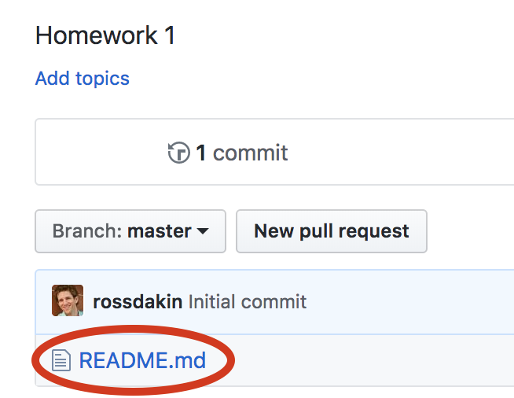
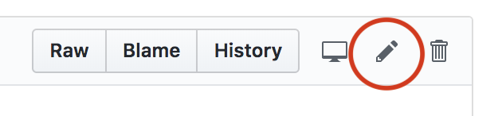
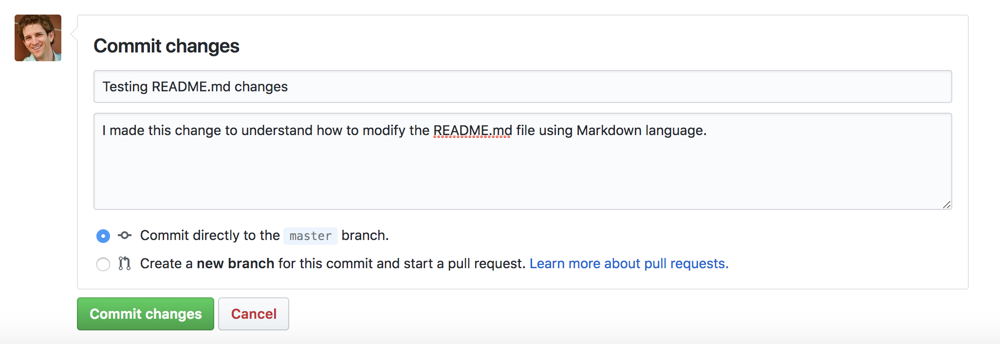

# Homework 1

This homework assignment covers the content that we discussed in class up until and including February 5.

## GitHub

We will exlusively use GitHub for all assignments in this class. Therefore (and because it is broadly used in industry), you should familiarize yourself with GitHub and its features.

### 1. Learn about GitHub

Perform this "Hello World" exercise: https://guides.github.com/activities/hello-world/

### 2. Understand Markdown

[Markdown](https://en.wikipedia.org/wiki/Markdown) is a language for simple text formatting. Usually, markdown files end in `.md` (like this file, `README.md`).

You will complete this homework assignment by modifying this Markdown file (`README.md`).

Take a look at these resources to understand Markdown basics:

* https://help.github.com/articles/basic-writing-and-formatting-syntax/
* https://guides.github.com/features/mastering-markdown/
* https://github.com/adam-p/markdown-here/wiki/Markdown-Cheatsheet

### 3. Modify README

Read about the `README.md` file: https://help.github.com/articles/about-readmes/

Now, edit the `README.md` file in this homework repository by clicking the `README.md` file in the list of files:

Then click the pencil icon to edit it:

Next, edit this line to add your name: **Your Name**

Click the "Preview changes" tab to see your changes.

When you are happy with your changes, click the "Commit changes" button at the bottom (optionally entering a commit title and description):

You should now see your name above (instead of "Your Name"). You can also see your change in the repository's [commit history]().

### 4. LinkedIn profile URL

[LinkedIn](linkedin.com) is a professional networking site used by almost all companies and recruiters. By establishing your professional profile now, to can begin to connect with other classmates and build your professional network.

Please sign up for LinkedIn and share your LinkedIn profile URL here. If you do not wish to be a member of LinkedIn, please write "I decline.":

[My LinkedIn Profile](https://www.linkedin.com/in/.../)

### 5. Setup GitHub Pages

[GitHub Pages](https://pages.github.com/) is a feature of GitHub that lets you serve webpages directly from a GitHub repository.

You will need to do this once for each homework assignment and class project.

* TODO

What’s a webpage?

Reading

Website I like
Website I don’t like

Advanced / extra credit…?

Where to look for authoritative HTML/CSS info? Send on a hunt

HTML should contain / convey ___ and CSS should contain / convey ___.

Doctype, HTML versions, XML, XHTML

CSS ID/class plurality

Accessibility 

Pace check

Narrative

Link to one web development job based in NYC
* What do you still need to learn to meet the requirements?

Accessibility 

URL composition

Html / head / body

Tags that don’t have a closing pair?

Are web pages ASCII (plain text) files, or compiled (binary) files like an executable program? Interpreted or executed?

White space

Headings, paragraphs, super, sub, bold, italic, hr, br, abbreviations

Lists (ul, ol, definition, nested)

Links (other page, same page, new window)

Images (alt, storage / linkage)

Tables

Comments

Iframes 

Bug fixes
